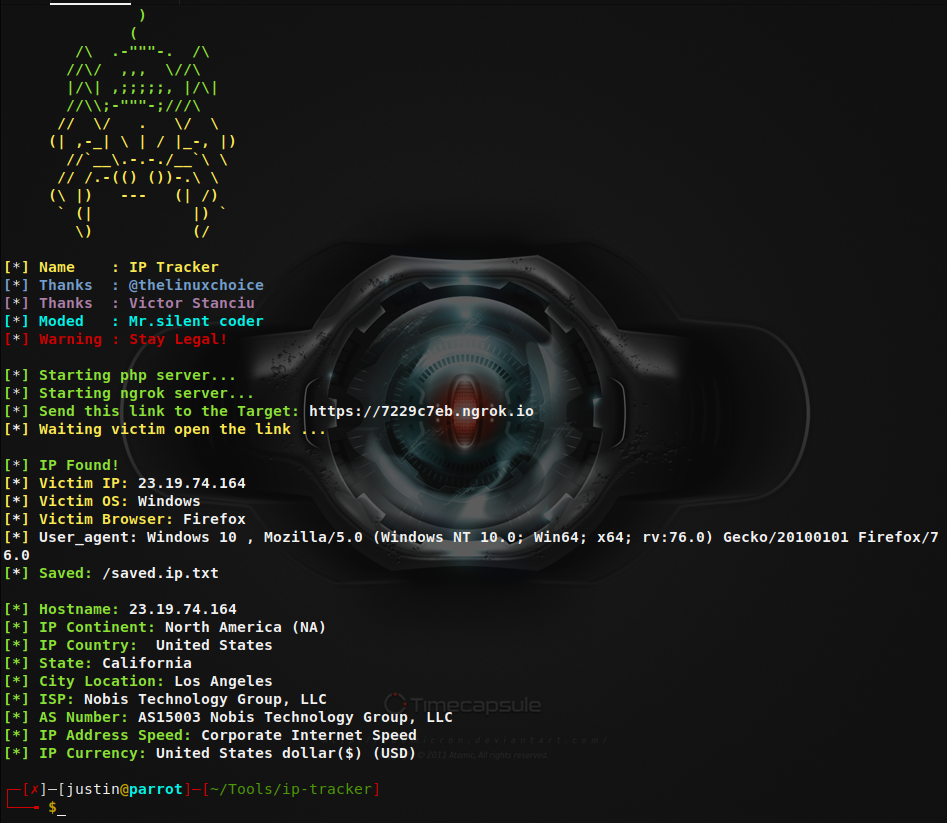

# ip-tracker

 
<h2>Usage:</h2>
 
<b>Install ngrok</a>
 
<b>sudo mv ngrok /usr/local/bin <b>
 
  
#root
 
<b>git clone https://github.com/Mr-silentcoder/ip-tracker.git <b> 
<b>cd ip-tracker <b>  
<b>chmod 777 ip-track.sh <b> 
<b>./ip-track.sh<b>

 
Open New Terminal then Run ngrok http 80.
 

<b>credits @<a href="https://github.com/thelinuxchoice">Thelinuxchoice</a> , @<a href="https://github.com/serbanghita/Mobile-Detect">Mobile-Detect</a><b>
